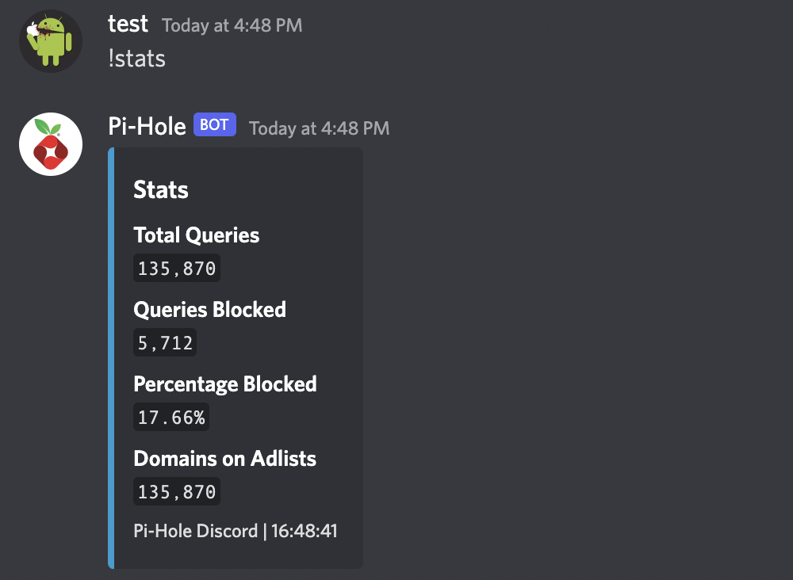
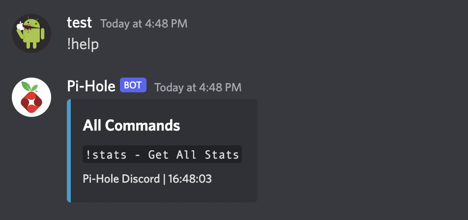
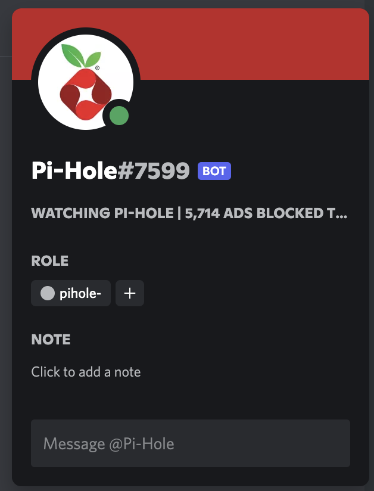

# <div classname="title" align=center>Pi-Hole-Discord</div>

## <div classname="subtitle" align=center>A Discord bot to get Pi-Hole stats</div>

## 📸 Screenshots
<div align="center"></div>
<div align="center"></div>
<div align="center"></div>
<div align="center"></div>

## Getting Started

### Prerequisites
* Python
* Discord Bot

### Create Your Discord Bot
1. Go to <a href="https://discord.com/developers/applications">Discord Developer Portal</a>
2. Click "New Application"
3. Enter your desired bot's name
4. Click "Create"
5. Click "Bot", then "Add Bot"
6. Copy your bot's token and save it in your environment variables.

### Add Bot To Your Server
1. In the Discord Developer Portal, click on your app.
2. Click "OAuth2", then click "URL generator" to generate an invite link for your bot.
3. In "Scopes", select "bot"
4. In "Bot Permissions", select "Change Nickname" and "Send Messages"
5. Go to the generated URL and add it to your desired server.

### Installation
1. Clone the repo
    ```sh
   git clone https://github.com/andyqvo/pihole-discord.git
   ```
2. Install pip packages
    ```sh
    pip install -r requirements.txt
    ```
3. Copy ```example.env``` as ```.env``` and set your environment variables. 

### Usage
1. To start your bot, run
    ```sh
    python pihole.py
    ```

### Bot Commands
* Help
    ```sh
    !help
    ```
* Show All Stats
    ```sh
    !stats
    ```